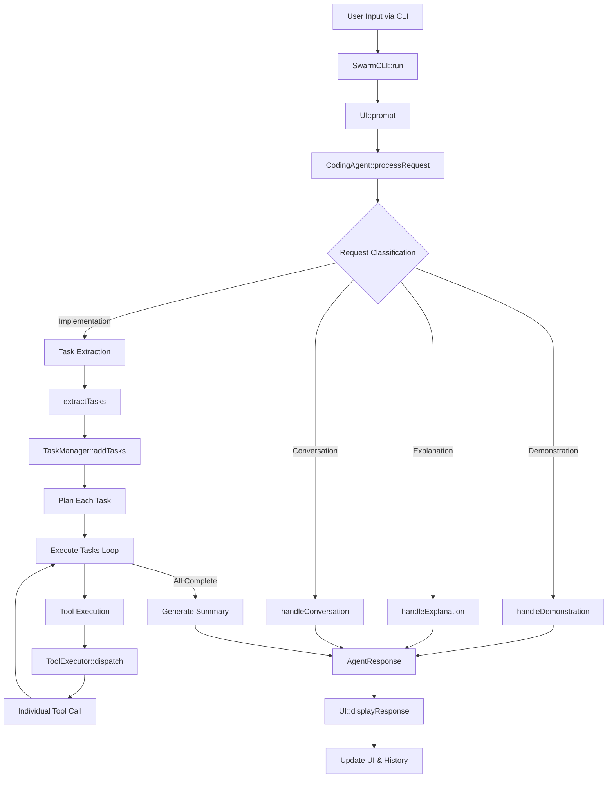
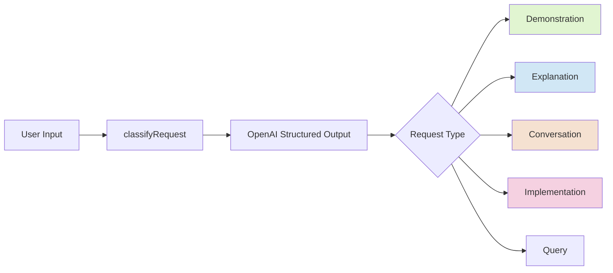
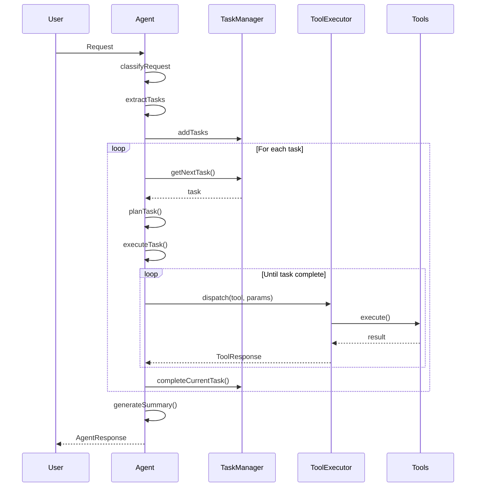
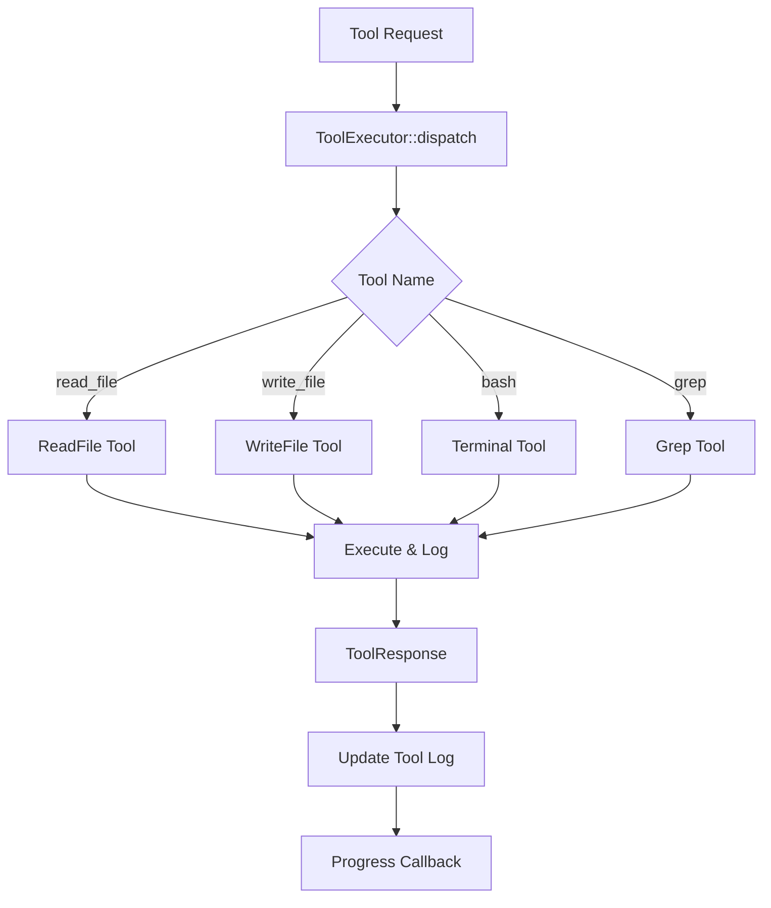
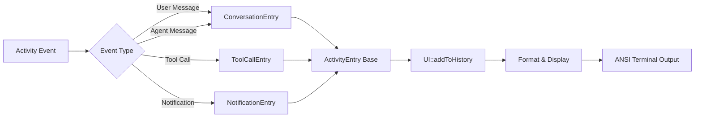
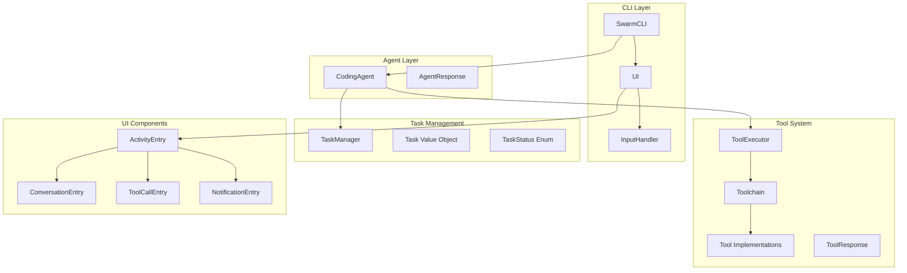
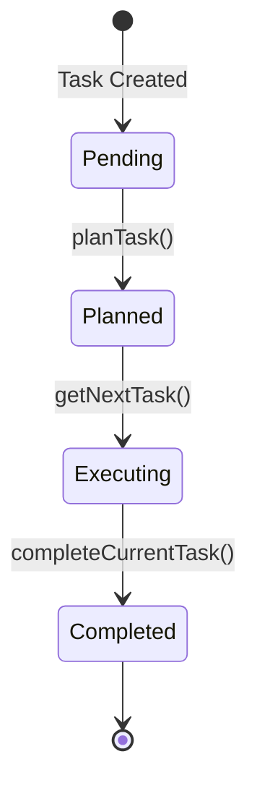

# Swarm AI Coding Assistant - System Architecture Overview

## Table of Contents
1. [System Overview](#system-overview)
2. [Core Flow Diagrams](#core-flow-diagrams)
3. [Component Architecture](#component-architecture)
4. [Key Classes and Their Responsibilities](#key-classes-and-their-responsibilities)
5. [Data Flow](#data-flow)
6. [Task Execution Analysis](#task-execution-analysis)
7. [Adding New Tools](#adding-new-tools)
8. [Configuration](#configuration)

## System Overview

Swarm is an AI-powered coding assistant that uses OpenAI's GPT models to understand natural language requests and execute coding tasks. The system uses a modular architecture with clear separation of concerns.

### Main System Flow



## Core Flow Diagrams

### Request Classification Flow



### Task Execution Flow



### Tool Execution Flow



### UI Update Flow



## Component Architecture

### Core Components Diagram



## Key Classes and Their Responsibilities

### Agent System

#### CodingAgent (`src/Agent/CodingAgent.php`)
The main AI agent that processes user requests:
- **Request Classification**: Uses structured outputs to determine request type (implementation, demonstration, explanation, conversation)
- **Task Extraction**: Extracts actionable tasks from user input
- **Task Planning**: Creates execution plans for each task
- **Task Execution**: Executes tasks using available tools
- **Conversation Management**: Maintains conversation history
- **Summary Generation**: Creates summaries of completed work

Key methods:
- `processRequest()`: Main request handler
- `classifyRequest()`: Uses structured output to classify intent
- `extractTasks()`: Extracts actionable tasks from requests
- `planTask()`: Creates execution plan for tasks
- `executeTask()`: Runs task with tool calls
- `handleDemonstration/Explanation/Conversation()`: Specialized handlers

#### ToolExecutor (`src/Core/ToolExecutor.php`)
Manages tool registration and execution:
- Routes tool calls to appropriate handlers
- Provides OpenAI function schemas for all tools
- Maintains execution log
- Handles tool execution errors gracefully
- Progress reporting support

#### Toolchain (`src/Core/Toolchain.php`)
Static registry that registers all available tools:
- Central place to register tool instances
- Provides a simple interface to add new tools
- Current tools: ReadFile, WriteFile, Terminal, Grep

### Tools

#### ReadFile
Reads contents of files from the filesystem:
- Takes a file path as input
- Returns file content, size, and line count
- Handles file not found errors

#### WriteFile  
Creates or overwrites files:
- Takes file path and content
- Creates directories if needed
- Returns bytes written

#### Terminal
Executes shell commands:
- Runs bash commands with timeout support
- Captures stdout, stderr, and return codes
- Handles command execution errors

#### Grep (merged FindFiles + Search)
Searches for content in files:
- Find files by pattern
- Search content within files
- Support for case-sensitive/insensitive search
- Recursive directory searching

### CLI & UI

#### SwarmCLI (`src/CLI/SwarmCLI.php`)
Main command-line interface:
- Handles user input and commands
- Manages the main interaction loop
- Integrates with TUI for rich display
- Supports both sync and async processing
- Special commands: help, exit, clear

#### UI (`src/CLI/UI.php`)
Terminal User Interface rendering:
- Creates bordered UI with ANSI escape codes
- Shows task progress and status
- Displays conversation history
- Handles terminal resizing
- Provides animations and progress indicators
- Type-safe activity entries

#### InputHandler (`src/CLI/InputHandler.php`)
Protected input handling using PsySH:
- Prevents accidental prompt deletion
- Provides command history
- Handles special key combinations safely

### Activity System (`src/CLI/Activity/*`)
Type-safe activity entries for UI display:

#### ActivityEntry (Base Class)
- Common functionality for all activity types
- Timestamp management
- Color and icon handling

#### ConversationEntry
- User and agent messages
- JSON parsing for function calls
- Human-readable formatting

#### ToolCallEntry
- Tool execution display
- Parameter summaries
- Result formatting

#### NotificationEntry
- System notifications
- Error messages
- Status updates

### Task Management

#### TaskManager (`src/Task/TaskManager.php`)
Manages multi-step task execution:
- Tracks task status (pending, planned, executing, completed)
- Maintains task queue
- Associates plans and steps with tasks
- Provides task progress information

#### Task (`src/Task/Task.php`)
Immutable value object representing tasks:
- Unique ID and description
- Status tracking with TaskStatus enum
- Plan and steps storage
- Timestamps for tracking
- Immutable state transitions

#### TaskStatus (`src/Task/TaskStatus.php`)
Enum for task states:
- Pending: Just created
- Planned: Has execution plan
- Executing: Currently running
- Completed: Finished

### Support Classes

#### PromptTemplates (`src/Prompts/PromptTemplates.php`)
Dynamic prompt generation for different scenarios:
- Classification prompts
- Task extraction prompts
- Execution prompts with available tools
- Conversation and explanation prompts
- Code assistance prompts (explain, refactor, debug, review, generate, document, test)

#### AgentResponse (`src/Agent/AgentResponse.php`)
Standardized response format from the agent:
- Success/error status
- Response message
- Consistent interface for UI

#### ToolResponse (`src/Core/ToolResponse.php`)
Standardized response format from tools:
- Success/error status
- Response data
- Error messages

#### ExceptionHandler (`src/Utils/ExceptionHandler.php`)
Global exception handling:
- Formats errors for display
- Logs exceptions
- Provides user-friendly error messages

### Async Processing

#### StreamingBackgroundProcessor (`src/Async/StreamingBackgroundProcessor.php`)
Manages background process execution:
- Launches PHP processes for async work
- Uses pipes for real-time communication
- Monitors process status
- Handles timeouts gracefully

#### StreamingAsyncProcessor (`src/Async/StreamingAsyncProcessor.php`)
Background worker for async requests:
- Processes requests in separate process
- Streams progress updates via stdout
- Handles signals for graceful shutdown
- Sends heartbeat messages

## Data Flow

### Standard Request Flow

1. **User Input**: User enters request in SwarmCLI
2. **Request Processing**: Request sent to CodingAgent
3. **Classification**: Agent classifies the request type using structured outputs
4. **Routing by Type**:
   - **Demonstration**: Return code examples
   - **Explanation**: Provide educational content
   - **Conversation**: General discussion
   - **Implementation**: Extract and execute tasks
5. **Task Processing** (for implementation):
   - Extract specific tasks from input
   - Plan each task with steps
   - Execute using tools via ToolExecutor
   - Generate summary of work done
6. **Display**: Results displayed in TUI with proper formatting
7. **History**: Conversation history maintained for context

### Tool Execution Flow

```mermaid
stateDiagram-v2
    [*] --> ToolRequest: User task needs tool
    ToolRequest --> Dispatch: ToolExecutor::dispatch()
    Dispatch --> Execute: Tool::execute()
    Execute --> Log: Log execution
    Log --> Response: Return ToolResponse
    Response --> [*]
```

## Task Execution Analysis

### Current Task State Machine



### Issue: No Deferred Execution

The current system executes all tasks immediately after extraction. There's no mechanism to:
- Defer task execution until a condition is met
- Wait for user confirmation
- Handle staged workflows

Example problem:
```
User: "add 4 tasks and say hello, we will do the tasks after i say start"
System: Creates 2 tasks and executes both immediately
```

## Adding New Tools

1. **Create Tool Class**: Extend `Tool` abstract class
   ```php
   class MyTool extends Tool {
       public function name(): string { return 'my_tool'; }
       public function description(): string { return 'Does something'; }
       public function parameters(): array { /* OpenAI schema */ }
       public function execute(array $params): ToolResponse { /* logic */ }
   }
   ```

2. **Register in Toolchain**: Add to `Toolchain::registerAll()`
   ```php
   $executor->register(new MyTool($logger));
   ```

3. **Tool Automatically Available**: Agent can now use the tool

## Configuration

### Environment Variables

| Variable | Description | Default |
|----------|-------------|---------|
| `OPENAI_API_KEY` | Required for AI functionality | - |
| `OPENAI_MODEL` | Model to use | gpt-4 |
| `OPENAI_TEMPERATURE` | Creativity level | 0.7 |
| `LOG_ENABLED` | Enable file logging | false |
| `LOG_LEVEL` | Logging level | info |
| `LOG_PATH` | Log file location | storage/logs |
| `SWARM_REQUEST_TIMEOUT` | Max request time in seconds | 60 |
| `SWARM_TIMEOUT_RETRY_ENABLED` | Allow retry on timeout | true |
| `SWARM_HEARTBEAT_INTERVAL` | Heartbeat frequency | 2 |

### Logging

The system uses PSR-3 compatible logging throughout:
- **Debug**: Detailed execution flow
- **Info**: Key operations and results
- **Warning**: Non-critical issues
- **Error**: Failures and exceptions

Logs include:
- OpenAI API calls and responses
- Tool executions with parameters
- Task state transitions
- Error traces for debugging

## Future Improvements

1. **Deferred Task Execution**: Add ability to queue tasks for later execution
2. **Task Persistence**: Save/load task queues across sessions
3. **Parallel Execution**: Run independent tasks concurrently
4. **Plugin System**: Dynamic tool loading from external packages
5. **Web Interface**: Browser-based UI option
6. **Multi-Model Support**: Add support for other LLM providers

## Architecture Principles

1. **Separation of Concerns**: Each component has a single responsibility
2. **Type Safety**: Use of enums, value objects, and typed arrays
3. **Immutability**: Task objects are immutable with state transitions
4. **Extensibility**: Easy to add new tools and capabilities
5. **Error Handling**: Graceful degradation with user-friendly messages
6. **Logging**: Comprehensive logging for debugging and monitoring