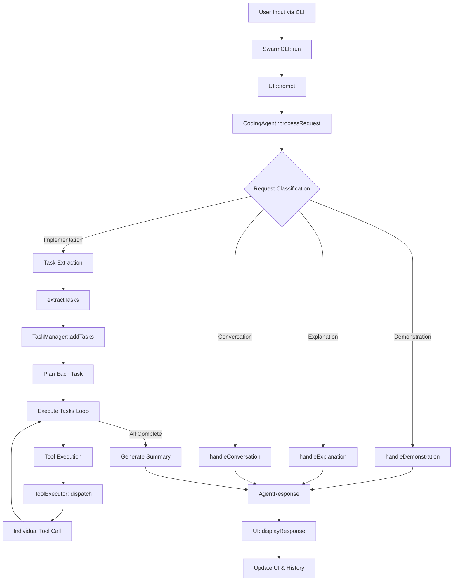
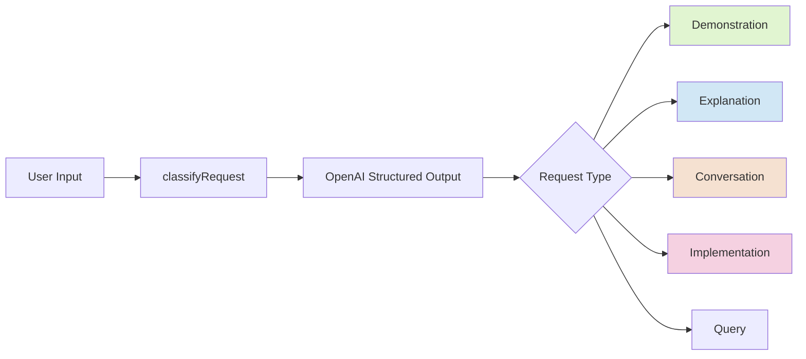
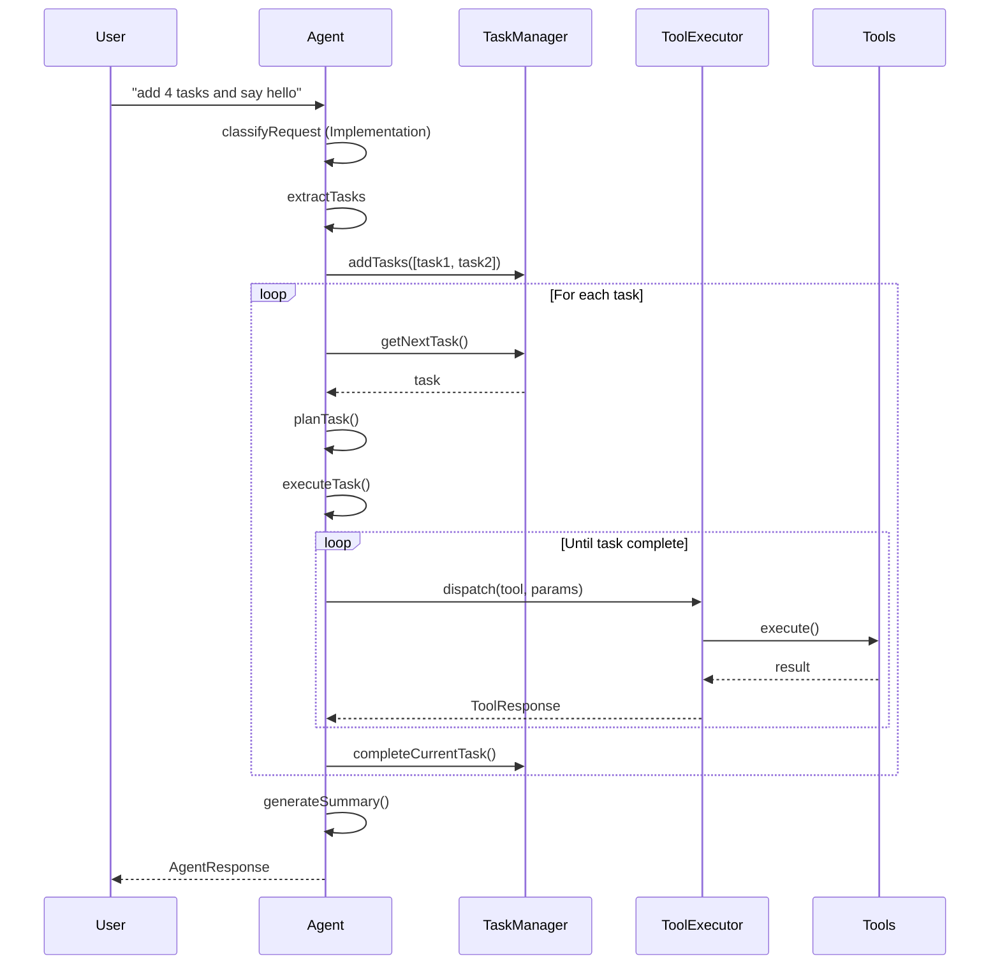
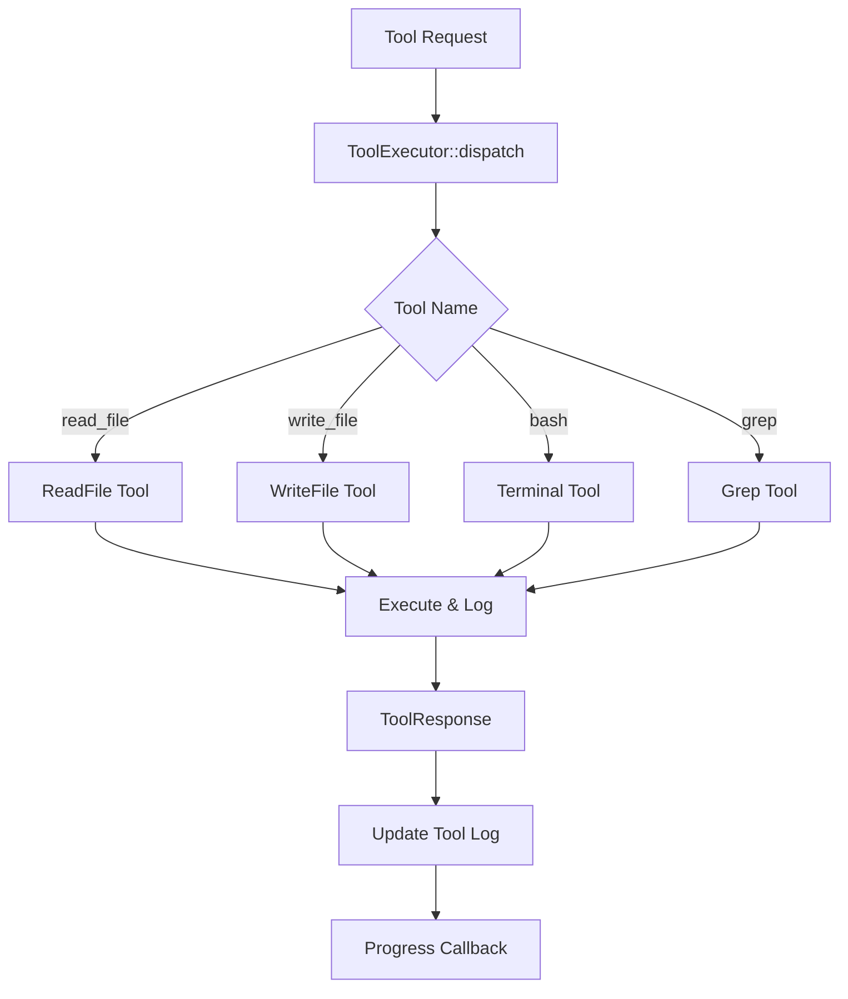
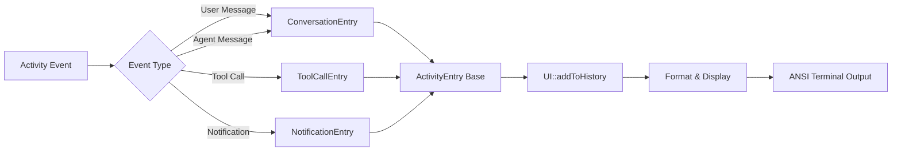
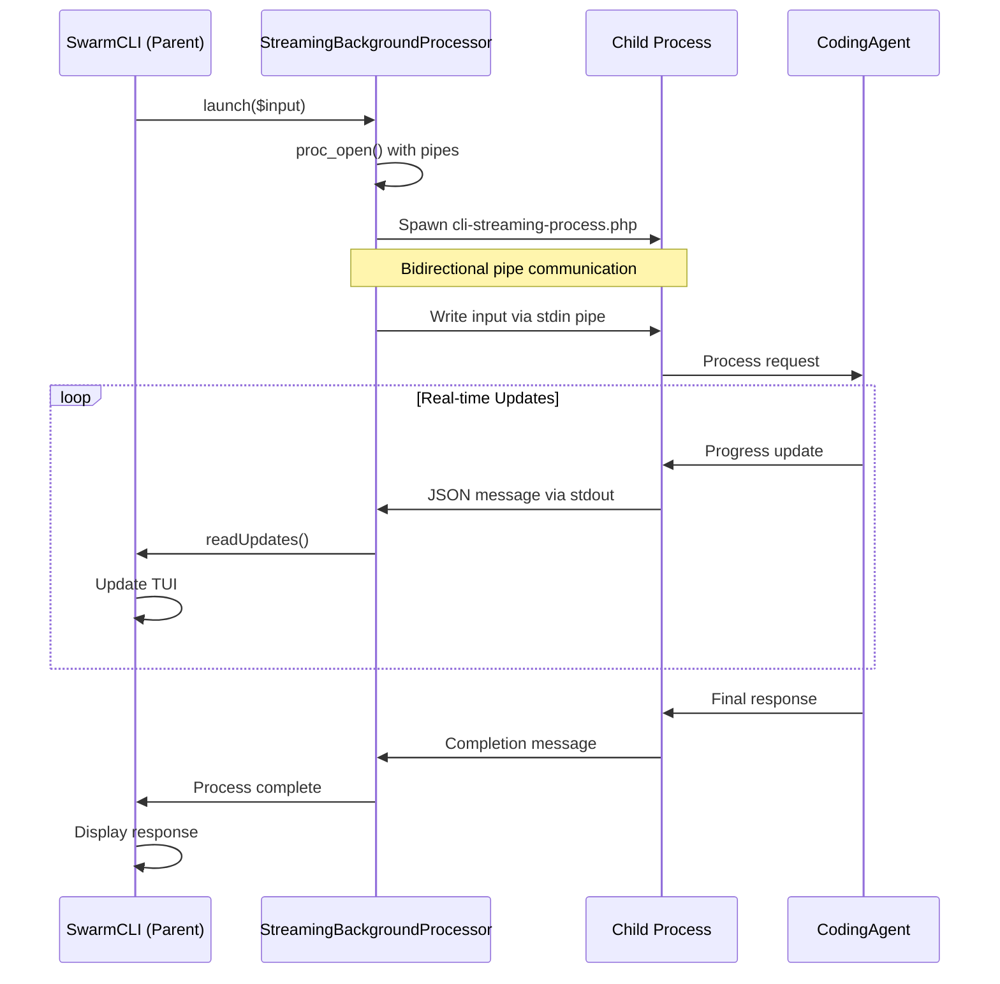
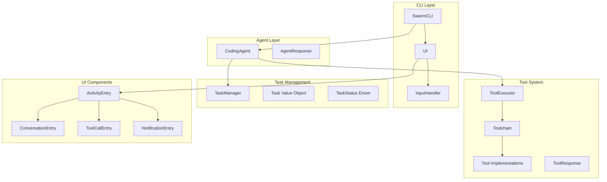
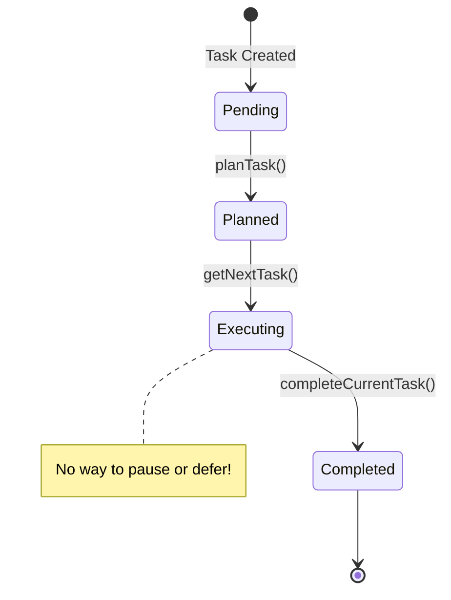
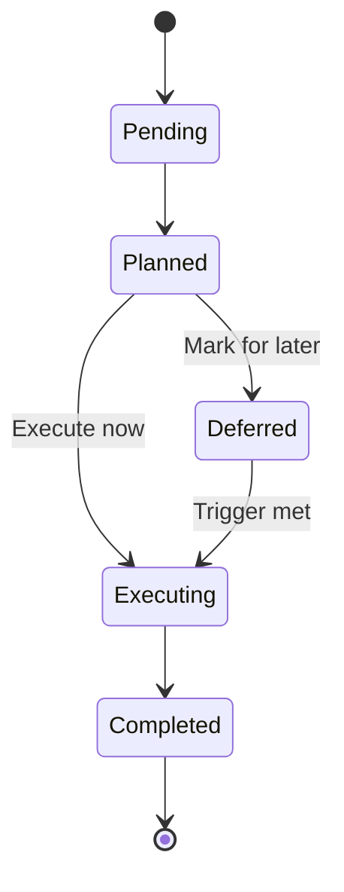
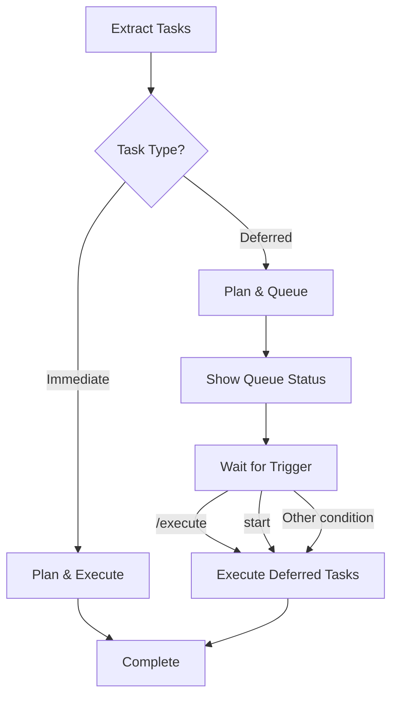

# Swarm AI Coding Assistant - System Architecture Overview

## Table of Contents
1. [System Overview](#system-overview)
2. [Core Flow Diagrams](#core-flow-diagrams)
3. [Component Architecture](#component-architecture)
4. [Key Classes and Their Responsibilities](#key-classes-and-their-responsibilities)
5. [Task Execution Issue Analysis](#task-execution-issue-analysis)
6. [Proposed Deferred Execution Solution](#proposed-deferred-execution-solution)

## System Overview

Swarm is an AI-powered coding assistant that uses OpenAI's GPT models to understand natural language requests and execute coding tasks. The system uses a modular architecture with clear separation of concerns.

### Main System Flow



## Core Flow Diagrams

### Request Classification Flow



### Task Execution Flow (Current - Immediate Execution)



### Tool Execution Flow



### UI Update Flow



### IPC and Streaming Architecture

The system uses a sophisticated Inter-Process Communication (IPC) mechanism for real-time updates and non-blocking execution:



#### Message Protocol

All IPC messages are JSON-encoded with a type field:

```php
// Progress updates
{
    "type": "progress",
    "message": "Classifying request..."
}

// State synchronization
{
    "type": "state_sync",
    "data": {
        "tasks": [...],
        "conversation_history": [...],
        "tool_log": [...],
        "operation": "executing_task"
    }
}

// Completion
{
    "type": "status",
    "status": "completed",
    "response": {
        "message": "Task completed successfully"
    }
}

// Error
{
    "type": "status", 
    "status": "error",
    "error": "Error message"
}
```

#### StreamingBackgroundProcessor (`src/CLI/StreamingBackgroundProcessor.php`)

Key responsibilities:
- Process lifecycle management (launch, terminate, cleanup)
- Pipe-based communication setup
- Non-blocking message reading
- JSON message parsing and validation
- Error handling and timeout management

Key methods:
- `launch($input)`: Spawns child process with pipes
- `readUpdates()`: Non-blocking read of all available messages
- `terminate()`: Graceful process termination
- `cleanup()`: Resource cleanup

#### Benefits of IPC Architecture

1. **Non-blocking UI**: Parent process remains responsive while child executes
2. **Real-time feedback**: Progress updates shown immediately
3. **Clean separation**: UI logic isolated from processing logic
4. **Graceful termination**: Can cancel long-running operations
5. **State synchronization**: Full state updates during execution

## Component Architecture

### Core Components



## Key Classes and Their Responsibilities

### 1. **SwarmCLI** (`src/CLI/SwarmCLI.php`)
- Main entry point for the application
- Manages the main loop
- Coordinates between TUI and Agent
- Handles special commands (help, exit, clear)

### 2. **CodingAgent** (`src/Agent/CodingAgent.php`)
- Core AI logic and OpenAI integration
- Request classification and routing
- Task extraction and planning
- Tool execution coordination
- Conversation history management

Key methods:
- `processRequest()`: Main request handler
- `classifyRequest()`: Uses structured output to classify intent
- `extractTasks()`: Extracts actionable tasks from requests
- `planTask()`: Creates execution plan for tasks
- `executeTask()`: Runs task with tool calls
- `handleDemonstration/Explanation/Conversation()`: Specialized handlers

### 3. **TaskManager** (`src/Task/TaskManager.php`)
- Manages task queue and lifecycle
- Tracks task status transitions
- Provides next task for execution

Current capabilities:
- Task history persistence (last 1000 completed tasks)
- Automatic migration for existing state files
- Execution time tracking

Current limitations:
- No support for deferred execution
- No conditional execution

### 4. **ToolExecutor** (`src/Core/ToolExecutor.php`)
- Routes tool calls to implementations
- Maintains execution log
- Provides tool descriptions for prompts
- Progress reporting

### 5. **Toolchain** (`src/Core/Toolchain.php`)
- Registers available tools
- Current tools: ReadFile, WriteFile, Terminal, Grep

### 6. **UI** (`src/CLI/UI.php`)
- Terminal UI management with ANSI codes
- Activity history display
- Real-time updates
- Input handling

### 7. **Activity System** (`src/CLI/Activity/*`)
- Type-safe activity entries
- Human-readable formatting
- JSON parsing for function calls

## Task Execution Issue Analysis

### The Problem

From the logs at `[2025-07-18T22:27:13]`, when the user requested:
> "add 4 tasks in the task list and say 'hello', we will do the tasks after i say start"

The system:
1. Created two tasks:
   - "say 'hello'" ✓
   - "do the tasks after i say start" ✓
2. **Immediately executed both tasks**
3. The second task just prompted for "start" but didn't wait

### Root Cause

The issue lies in `CodingAgent::processRequest()`:

```php
// Execute tasks one by one
while ($currentTask = $this->taskManager->getNextTask()) {
    $this->executeTask($currentTask);
    $this->taskManager->completeCurrentTask();
}
```

**Tasks are executed immediately after extraction**, with no mechanism to:
- Defer execution
- Wait for conditions
- Handle user triggers

### Current Task Flow



## Proposed Deferred Execution Solution

### Design Options

#### Option 1: Task Status Extension
Add new statuses for deferred execution:



#### Option 2: Task Metadata with Conditions
Add execution conditions to tasks:

```php
class Task {
    public readonly ?array $executionConditions;
    // e.g., ['type' => 'user_input', 'value' => 'start']
}
```

#### Option 3: Task Queue Modes
Add execution modes to TaskManager:

```php
enum ExecutionMode {
    case Immediate;    // Current behavior
    case Manual;       // Wait for explicit execute command
    case Conditional;  // Wait for conditions
}
```

### Recommended Implementation

**Hybrid approach combining Options 2 & 3:**

1. **Add execution metadata to tasks**
   ```php
   class Task {
       public readonly ExecutionMode $executionMode;
       public readonly ?array $executionTrigger;
   }
   ```

2. **Modify task extraction to detect deferred intent**
   ```php
   // In extractTasks(), detect phrases like:
   // "after I say", "when I", "wait for"
   ```

3. **Add new CLI commands**
   ```
   /tasks        - Show task queue
   /execute      - Execute deferred tasks
   /execute <id> - Execute specific task
   ```

4. **Update processRequest flow**
   ```php
   if ($hasImmediateTasks) {
       // Execute immediately
   }
   if ($hasDeferredTasks) {
       // Add to queue, show notification
       return "Added X tasks. Type '/execute' when ready.";
   }
   ```

### Implementation Flow



## State Persistence

### State File Structure (.swarm.json)

The system automatically saves and loads state from `.swarm.json`:

```json
{
  "tasks": [
    {
      "id": "task_123",
      "description": "Active task",
      "status": "pending",
      "created_at": 1234567890
    }
  ],
  "task_history": [
    {
      "id": "task_456",
      "description": "Completed task",
      "status": "completed",
      "created_at": 1234567890,
      "completed_at": 1234567900,
      "execution_time": 10,
      "plan": "Task execution plan",
      "steps": ["step1", "step2"]
    }
  ],
  "current_task": null,
  "conversation_history": {},
  "tool_log": [],
  "operation": ""
}
```

### Task History Features

1. **Automatic Archival**: Completed tasks are automatically moved to `task_history`
2. **History Limit**: Maintains last 1000 completed tasks (configurable)
3. **Execution Tracking**: Records completion time and execution duration
4. **State Persistence**: Survives across sessions
5. **Backward Compatibility**: Old state files are automatically migrated

### State Management Commands

- State is automatically saved:
  - On graceful shutdown (Ctrl+C)
  - After task completion
  - When using `save` command
- Manual commands:
  - `save` - Manually save current state
  - `clear-state` - Clear all state and start fresh

## Next Steps

1. **Immediate fixes needed:**
   - Add task execution modes
   - Implement deferred task queue
   - Add trigger detection in task extraction
   - Create /tasks and /execute commands

2. **Future enhancements:**
   - Task persistence (save/load)
   - Complex execution conditions
   - Task dependencies
   - Parallel execution support

3. **Documentation updates:**
   - Update CLAUDE.md with new task modes
   - Add examples of deferred execution
   - Document new CLI commands

This architecture provides a foundation for more sophisticated task management while maintaining the current immediate execution capabilities.