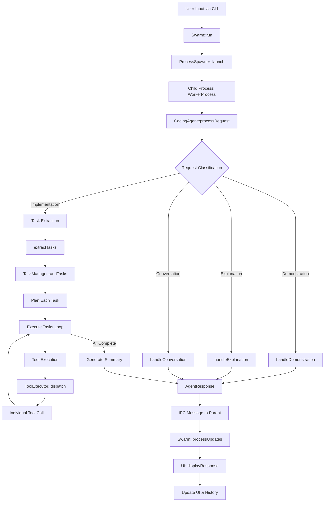
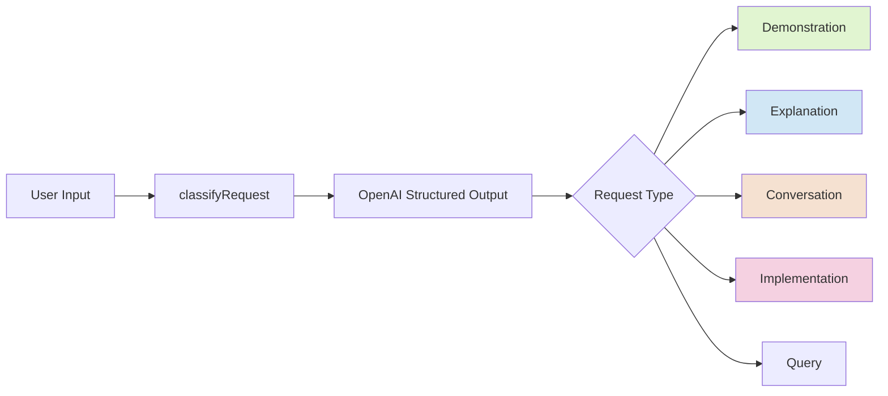
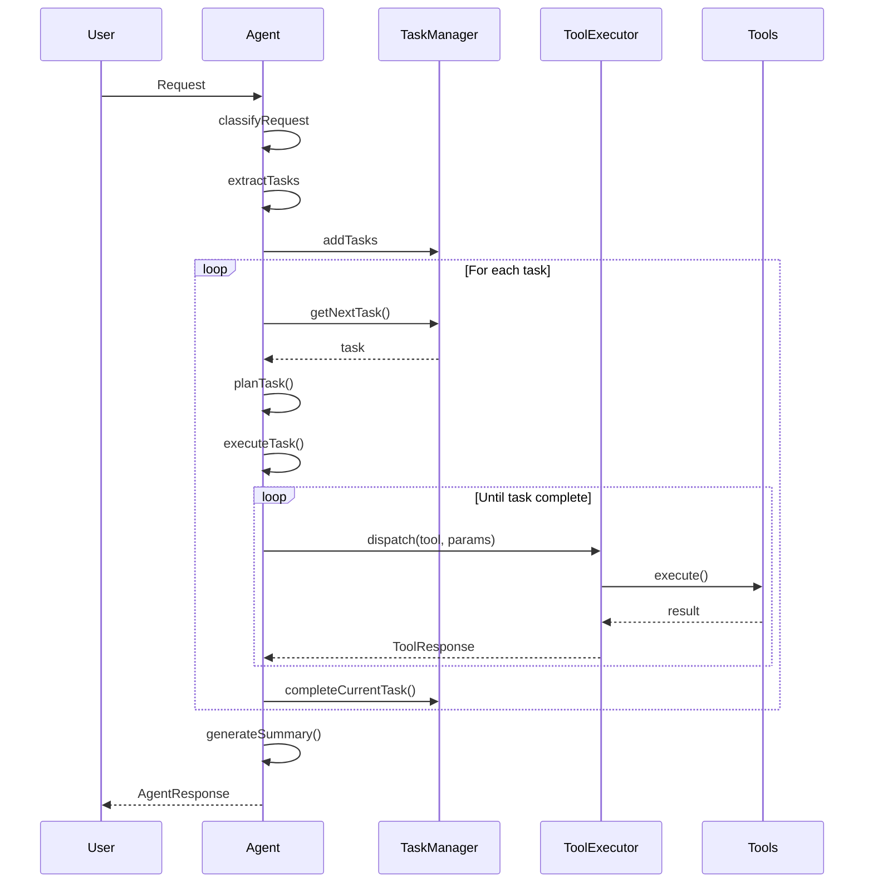
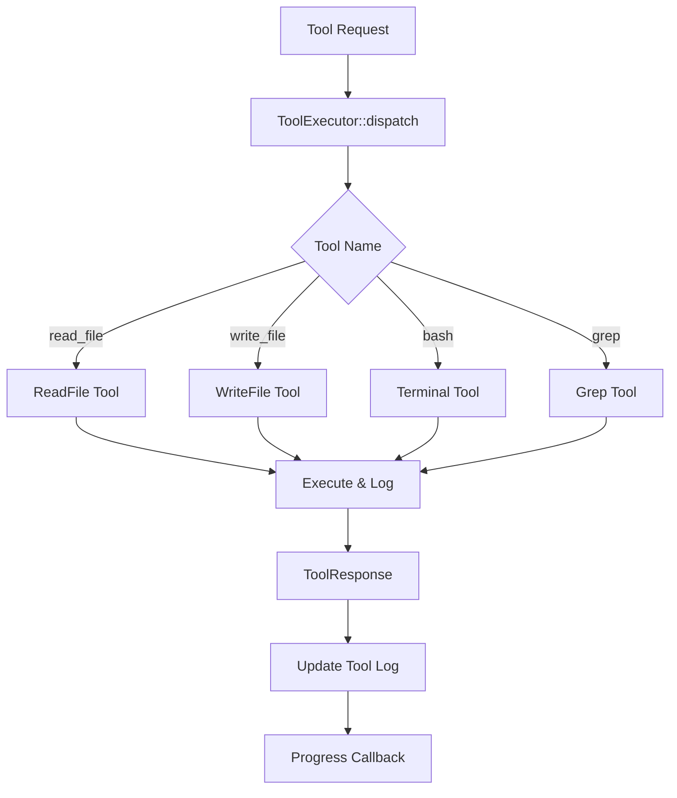
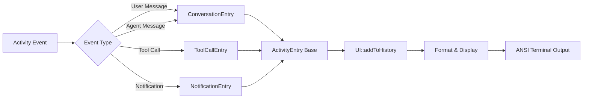
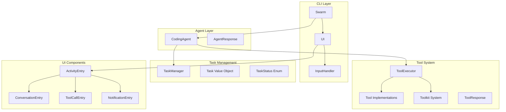
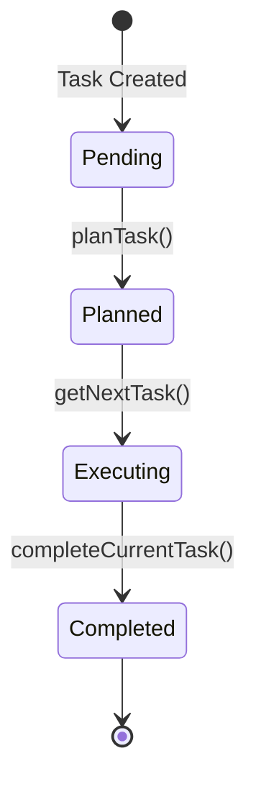
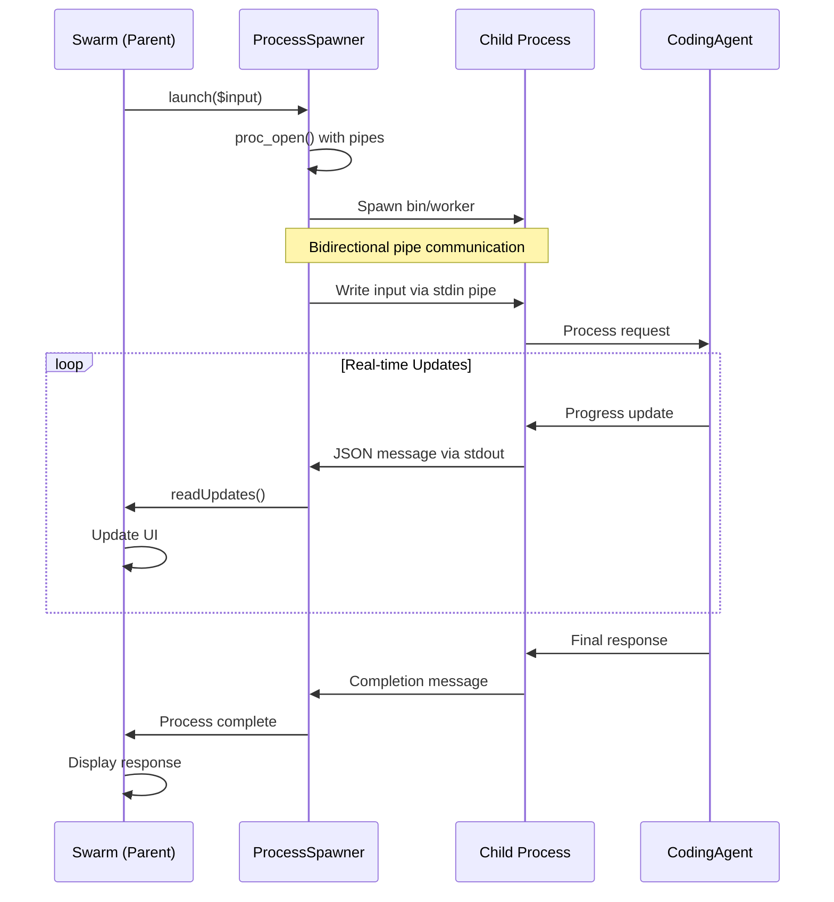

# Swarm AI Coding Assistant - System Architecture Overview

## Table of Contents
1. [System Overview](#system-overview)
2. [Core Flow Diagrams](#core-flow-diagrams)
3. [Component Architecture](#component-architecture)
4. [Key Classes and Their Responsibilities](#key-classes-and-their-responsibilities)
5. [Task Management](#task-management)
6. [IPC and Streaming Architecture](#ipc-and-streaming-architecture)
7. [State Persistence](#state-persistence)
8. [Adding New Tools](#adding-new-tools)
9. [Configuration](#configuration)
10. [Recent Improvements](#recent-improvements)

## System Overview

Swarm is an AI-powered coding assistant that uses OpenAI's GPT models to understand natural language requests and execute coding tasks. The system uses a modular architecture with clear separation of concerns.

### Main System Flow



## Core Flow Diagrams

### Request Classification Flow



### Task Execution Flow



### Tool Execution Flow



### UI Update Flow



## Component Architecture

### Core Components



## Key Classes and Their Responsibilities

### 1. **Swarm** (`src/CLI/Swarm.php`)
- Main entry point for the application
- Manages the main loop and state persistence
- Coordinates between UI and Agent
- Handles special commands (help, exit, clear, save, clear-state)
- Features:
  - Constructor dependency injection for testability
  - Static factory method `createFromEnvironment()`
  - Atomic file writes for state persistence
  - Configuration constants for maintainability
  - Extracted command and update handling methods

### 2. **CodingAgent** (`src/Agent/CodingAgent.php`)
- Core AI logic and OpenAI integration
- Request classification and routing
- Task extraction and planning
- Tool execution coordination
- Conversation history management

Key methods:
- `processRequest()`: Main request handler
- `classifyRequest()`: Uses structured output to classify intent
- `extractTasks()`: Extracts actionable tasks from requests
- `planTask()`: Creates execution plan for tasks
- `executeTask()`: Runs task with tool calls
- `handleDemonstration/Explanation/Conversation()`: Specialized handlers
- `getTaskManager()`: Access to task manager for history

### 3. **TaskManager** (`src/Task/TaskManager.php`)
- Manages task queue and lifecycle
- Tracks task status transitions
- Provides next task for execution
- Task history persistence (last 1000 completed tasks)
- Automatic migration for existing state files
- Execution time tracking

Key methods:
- `addToHistory()`: Archives completed tasks with duplicate prevention
- `getTaskHistory()` / `setTaskHistory()`: History access
- `clearCompletedTasks()`: Manages task lifecycle
- `getTasksAsArrays()`: Backward compatibility

### 4. **ToolExecutor** (`src/Core/ToolExecutor.php`)
- Registers available tools and toolkits
- Routes tool calls to implementations
- Maintains execution log
- Provides tool descriptions for prompts
- Progress reporting

### 5. **Tool System** (`src/Tools/*`)
- Individual tools: ReadFile, WriteFile, Terminal, Grep, WebFetch, Playwright
- Toolkit system: TavilyToolkit providing web search and extraction
- All tools extend abstract Tool class
- Toolkits implement Toolkit interface

### 6. **UI** (`src/CLI/UI.php`)
- Terminal UI management with ANSI codes
- Activity history display with type-safe entries
- Real-time updates
- Input handling
- Progress animations

### 7. **Activity System** (`src/CLI/Activity/*`)
- Type-safe activity entries (replaced error-prone arrays)
- Human-readable formatting
- JSON parsing for function calls
- Classes: ActivityEntry (base), ConversationEntry, ToolCallEntry, NotificationEntry

### 8. **Task** (`src/Task/Task.php`)
- Immutable value object with readonly properties
- Status tracking via TaskStatus enum
- Timestamps for creation and completion
- Immutable state transitions

### 9. **IPC System** (`src/CLI/*`)
- ProcessSpawner: Parent process management
- WorkerProcess: Child process execution  
- JSON message protocol for communication
- Real-time progress updates

## Task Management

### Task States



### Task History Features

1. **Automatic Archival**: Completed tasks are automatically moved to `task_history`
2. **History Limit**: Maintains last 1000 completed tasks (configurable)
3. **Execution Tracking**: Records completion time and execution duration
4. **State Persistence**: Survives across sessions
5. **Backward Compatibility**: Old state files are automatically migrated

## IPC and Streaming Architecture

The system uses a sophisticated Inter-Process Communication (IPC) mechanism for real-time updates and non-blocking execution:



### Message Protocol

All IPC messages are JSON-encoded with a type field:

```json
// Progress updates
{
    "type": "progress",
    "message": "Classifying request..."
}

// State synchronization
{
    "type": "state_sync",
    "data": {
        "tasks": [...],
        "conversation_history": [...],
        "tool_log": [...],
        "operation": "executing_task"
    }
}

// Completion
{
    "type": "status",
    "status": "completed",
    "response": {
        "message": "Task completed successfully"
    }
}

// Error
{
    "type": "status", 
    "status": "error",
    "error": "Error message"
}
```

### Benefits of IPC Architecture

1. **Non-blocking UI**: Parent process remains responsive while child executes
2. **Real-time feedback**: Progress updates shown immediately
3. **Clean separation**: UI logic isolated from processing logic
4. **Graceful termination**: Can cancel long-running operations
5. **State synchronization**: Full state updates during execution

## State Persistence

### State File Structure (.swarm.json)

The system automatically saves and loads state from `.swarm.json`:

```json
{
  "tasks": [
    {
      "id": "task_123",
      "description": "Active task",
      "status": "pending",
      "created_at": 1234567890
    }
  ],
  "task_history": [
    {
      "id": "task_456",
      "description": "Completed task",
      "status": "completed",
      "created_at": 1234567890,
      "completed_at": 1234567900,
      "execution_time": 10,
      "plan": "Task execution plan",
      "steps": ["step1", "step2"]
    }
  ],
  "current_task": null,
  "conversation_history": {},
  "tool_log": [],
  "operation": ""
}
```

### State Management Commands

- State is automatically saved:
  - On graceful shutdown (Ctrl+C)
  - After task completion
  - When using `save` command
- Manual commands:
  - `save` - Manually save current state
  - `clear-state` - Clear all state and start fresh

## Adding New Tools

1. **Create Tool Class**: Extend `Tool` abstract class
   ```php
   class MyTool extends Tool {
       public function name(): string { return 'my_tool'; }
       public function description(): string { return 'Does something'; }
       public function parameters(): array { /* OpenAI schema */ }
       public function execute(array $params): ToolResponse { /* logic */ }
   }
   ```

2. **Register in ToolExecutor**: Add to tool registration in `Swarm::createFromEnvironment()`
   ```php
   $executor->register(new MyTool($logger));
   ```

3. **Tool Automatically Available**: Agent can now use the tool

## Configuration

### Environment Variables

| Variable | Description | Default |
|----------|-------------|---------|
| `OPENAI_API_KEY` | Required for AI functionality | - |
| `OPENAI_MODEL` | Model to use | gpt-4o-mini |
| `TAVILY_API_KEY` | API key for Tavily search/extract | - |
| `OPENAI_TEMPERATURE` | Creativity level | 0.7 |
| `LOG_ENABLED` | Enable file logging | false |
| `LOG_LEVEL` | Logging level | info |
| `LOG_PATH` | Log file location | logs |
| `SWARM_REQUEST_TIMEOUT` | Max request time in seconds | 600 |
| `SWARM_TIMEOUT_RETRY_ENABLED` | Allow retry on timeout | true |
| `SWARM_HEARTBEAT_INTERVAL` | Heartbeat frequency | 2 |

### Logging

The system uses PSR-3 compatible logging throughout:
- **Debug**: Detailed execution flow
- **Info**: Key operations and results
- **Warning**: Non-critical issues
- **Error**: Failures and exceptions

Logs include:
- OpenAI API calls and responses
- Tool executions with parameters
- Task state transitions
- Error traces for debugging

## Recent Improvements

### Class Renaming (Latest)
- **SwarmCLI** → **Swarm** (clearer, more concise)
- **TUIRenderer** → **UI** (simpler, still clear in context)
- Updated all references in code, tests, and imports

### Enhanced Robustness
- **Atomic file writes**: Write to temp file, then rename
- **Better error recovery**: Graceful handling of file operation failures
- **State validation**: Added `validateState()` method
- **Exception handling**: Specific error messages and logging
- **Non-fatal errors**: State save failures don't crash the app

### Code Organization
- **Configuration constants**: Replace hardcoded values
- **Command handling extraction**: Match expression for cleaner code
- **Update processing simplification**: Dedicated handlers for each update type
- **Smaller, focused methods**: Better testability and maintainability

### Dependency Injection Refactoring
- Modified constructor to accept dependencies: `CodingAgent`, `UI`, and `LoggerInterface`
- Added `Swarm::createFromEnvironment()` static factory method
- Improved testability by allowing mock injection
- Maintained backward compatibility

### Task History Implementation
- Moved task history functionality from Swarm to TaskManager
- Added automatic archival of completed tasks
- 1000 task history limit by default
- Execution time tracking
- Duplicate prevention

### Type-Safe Activity System
- Replaced error-prone arrays with typed ActivityEntry classes
- Fixed "Undefined array key 'color'" error
- Improved UI reliability and maintainability

## Architecture Principles

1. **Separation of Concerns**: Each component has a single responsibility
2. **Type Safety**: Use of enums, value objects, and typed arrays
3. **Immutability**: Task objects are immutable with state transitions
4. **Extensibility**: Easy to add new tools and capabilities
5. **Error Handling**: Graceful degradation with user-friendly messages
6. **Logging**: Comprehensive logging for debugging and monitoring
7. **Testability**: Dependency injection and focused methods
8. **Robustness**: Atomic operations and validation

## Future Improvements

1. **Deferred Task Execution**: Add ability to queue tasks for later execution
2. **Task Dependencies**: Allow tasks to depend on completion of others
3. **Parallel Execution**: Run independent tasks concurrently
4. **Plugin System**: Dynamic tool loading from external packages
5. **Web Interface**: Browser-based UI option
6. **Multi-Model Support**: Add support for other LLM providers
7. **Advanced Task Conditions**: Complex execution triggers
8. **Task Templates**: Reusable task patterns